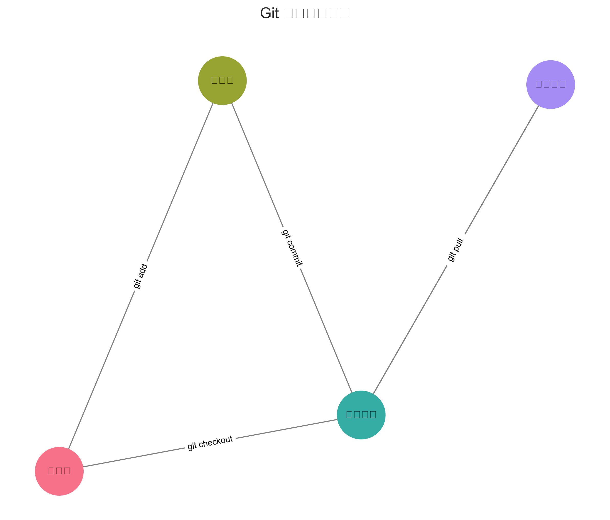
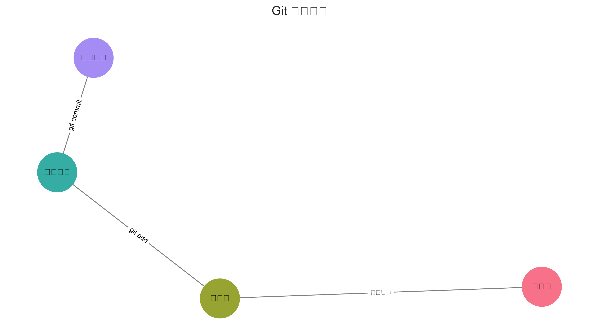
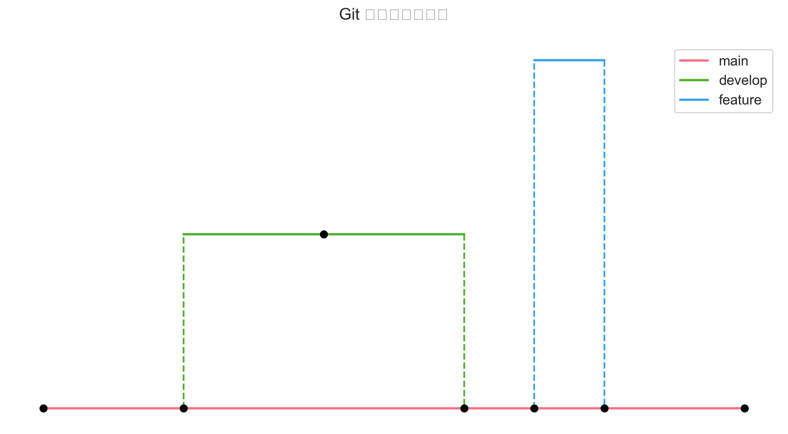

# Git 实践练习

在本节中，我们将通过动手练习来掌握之前学习的 Git 基础命令。跟随以下练习来加深你对 Git 基础知识的理解。

## Git 基本概念图解

### 工作区、暂存区和版本库



上图展示了 Git 的三个主要工作区域：
- 工作区（Working Directory）：你直接编辑的文件所在的区域
- 暂存区（Staging Area）：暂存待提交的修改
- 版本库（Repository）：保存项目的所有历史版本

### Git 工作流程


这个流程图展示了 Git 的基本工作流程：
1. 在工作区修改文件
2. 将修改添加到暂存区
3. 将暂存区的修改提交到版本库

## 练习1：初始化仓库

1. 创建一个新的项目目录：
   ```bash
   mkdir my-first-repo
   cd my-first-repo
   ```

2. 初始化一个新的 Git 仓库：
   ```bash
   git init
   ```
   > 提示：这个命令会创建一个 .git 目录，用于存储仓库的所有版本信息

3. 检查仓库状态：
   ```bash
   git status
   ```
   > 养成经常使用 git status 检查仓库状态的好习惯

## 练习2：创建你的第一个提交

1. 创建一个新的 `README.md` 文件：
   ```bash
   echo "# 我的第一个仓库" > README.md
   ```

2. 暂存文件：
   ```bash
   git add README.md
   ```
   > 使用 `git add .` 可以暂存所有修改的文件

3. 提交更改：
   ```bash
   git commit -m "初始提交：添加 README.md"
   ```
   > 提交信息应该简洁明了，说明本次提交的主要内容

### 理解提交过程



上图展示了文件从工作区到版本库的完整过程。

## 练习3：使用分支

### 分支的概念



分支允许你在不影响主分支的情况下进行开发。

1. 创建新分支：
   ```bash
   git branch feature-branch
   ```

2. 切换到新分支：
   ```bash
   git checkout feature-branch
   # 或使用简写命令：
   # git checkout -b feature-branch
   ```

3. 进行一些更改：
   ```bash
   echo "这是一个新功能" > feature.txt
   git add feature.txt
   git commit -m "添加新功能"
   ```

4. 切回主分支并合并：
   ```bash
   git checkout main
   git merge feature-branch
   ```

### 分支合并过程


上图展示了分支合并的过程和可能出现的冲突情况。

## 练习4：远程仓库操作

### 远程仓库工作流


1. 添加远程仓库（替换为你的仓库 URL）：
   ```bash
   git remote add origin <repository-url>
   ```

2. 推送你的更改：
   ```bash
   git push -u origin main
   ```
   > `-u` 参数设置跟踪关系，之后可以直接使用 `git push`

3. 从远程拉取更改：
   ```bash
   git pull origin main
   ```

## 实践任务

尝试完成以下任务来巩固你的 Git 技能：

1. 创建一个新仓库，并进行至少 3 次不同的提交
2. 创建一个分支，在其中进行更改，然后合并回主分支
3. 练习解决一个简单的合并冲突
4. 克隆一个现有仓库并做出贡献
5. 创建一个 `.gitignore` 文件并测试忽略文件功能

### 合并冲突解决示例


当两个分支修改了同一个文件的同一部分时，合并时会产生冲突。上图展示了如何解决冲突。

## 实际场景练习

### 场景1：多人协作
1. 两个人同时修改同一个文件的不同部分
2. 使用 `git pull` 更新代码
3. 解决可能出现的合并冲突
4. 推送最终更改

### 场景2：版本回退
1. 创建多个提交
2. 使用 `git log` 查看历史
3. 使用 `git reset` 回退到指定版本
4. 使用 `git revert` 撤销某个提交


### 场景3：分支管理
1. 创建功能分支（feature branch）
2. 创建修复分支（hotfix branch）
3. 在不同分支间切换
4. 合并多个分支的更改

## 常见问题及解决方案

- 如果遇到困难，使用 `git status` 检查仓库当前状态
- 撤销暂存的更改：`git reset HEAD <文件>`
- 放弃本地更改：`git checkout -- <文件>`
- 查看提交历史：`git log`
- 查看某个文件的修改历史：`git log -p <文件名>`
- 比较工作区和暂存区的差异：`git diff`
- 比较暂存区和最新提交的差异：`git diff --cached`
- 修改最后一次提交信息：`git commit --amend`

### 常见错误图解


## 进阶技巧

1. 交互式变基（Interactive Rebase）
   ```bash
   git rebase -i HEAD~3  # 修改最近3次提交
   ```

2. 储藏当前更改
   ```bash
   git stash  # 储藏更改
   git stash pop  # 恢复储藏的更改
   ```

3. 使用标签管理版本
   ```bash
   git tag v1.0.0  # 创建标签
   git push origin v1.0.0  # 推送标签
   ```

## 下一步

完成这些练习后，你应该能够熟练掌握：
- 仓库初始化
- 创建提交
- 分支操作
- 基本的远程仓库操作
- 解决合并冲突
- 版本回退和前进
- 分支管理策略

## 补充说明

- 所有的命令行操作建议在终端（Terminal）中执行
- Windows 用户可以使用 Git Bash 来执行这些命令
- 养成经常使用 `git status` 和 `git log` 的习惯，这样可以随时了解仓库状态
- 在进行重要操作前，建议先创建分支，这样可以避免直接影响主分支
- 定期推送到远程仓库，避免本地代码丢失
- 编写清晰的提交信息，便于后期维护
- 在团队中遵循统一的分支命名规范
- 重要的修改建议创建 Pull Request/Merge Request 进行代码审查

## 推荐的工作流程


1. 更新本地代码
   ```bash
   git pull origin main
   ```

2. 创建功能分支
   ```bash
   git checkout -b feature/new-feature
   ```

3. 定期提交更改
   ```bash
   git add .
   git commit -m "描述性的提交信息"
   ```

4. 保持与主分支同步
   ```bash
   git fetch origin
   git rebase origin/main
   ```

5. 推送更改并创建合并请求
   ```bash
   git push origin feature/new-feature
   ```

记住：Git 是一个强大的工具，熟练掌握这些基础操作后，你可以逐步探索更多高级功能。持续练习是提高 Git 技能的关键。
