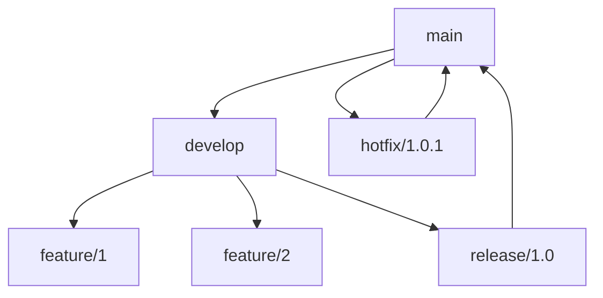

# GitFlow 工作流

本节将深入介绍 GitFlow 工作流的使用方法，这是一个基于分支的工作流程模型。

## 基本概念

### 1. 分支结构

1. 主要分支
- main/master：主分支
- develop：开发分支

2. 支持分支
- feature/*：特性分支
- release/*：发布分支
- hotfix/*：热修复分支
- bugfix/*：bug修复分支

### 2. 工作流程

1. 基本流程
```bash
# 初始化 GitFlow
git flow init

# 查看分支
git branch -a
```

2. 分支关系


## 特性开发

### 1. 特性分支

1. 创建特性
```bash
# 使用 git-flow
git flow feature start user-auth

# 传统方式
git checkout -b feature/user-auth develop
```

2. 完成特性
```bash
# 使用 git-flow
git flow feature finish user-auth

# 传统方式
git checkout develop
git merge --no-ff feature/user-auth
git branch -d feature/user-auth
```

### 2. 并行开发

1. 多特性开发
```bash
# 特性 1
git flow feature start feature1
git commit -m "feat: implement feature1"

# 特性 2
git flow feature start feature2
git commit -m "feat: implement feature2"
```

2. 特性同步
```bash
# 更新开发分支
git checkout develop
git pull

# 同步特性分支
git checkout feature/feature1
git rebase develop
```

## 发布管理

### 1. 发布分支

1. 创建发布
```bash
# 使用 git-flow
git flow release start 1.0.0

# 传统方式
git checkout -b release/1.0.0 develop
```

2. 完成发布
```bash
# 使用 git-flow
git flow release finish 1.0.0

# 传统方式
git checkout main
git merge --no-ff release/1.0.0
git checkout develop
git merge --no-ff release/1.0.0
git branch -d release/1.0.0
```

### 2. 版本管理

1. 版本标记
```bash
# 创建标签
git tag -a v1.0.0 -m "Version 1.0.0"

# 推送标签
git push origin v1.0.0
```

2. 发布说明
```markdown
# Release Notes v1.0.0

## Features
- User authentication
- API integration

## Bug Fixes
- Data validation
- UI improvements
```

## 问题修复

### 1. 热修复

1. 创建修复
```bash
# 使用 git-flow
git flow hotfix start 1.0.1

# 传统方式
git checkout -b hotfix/1.0.1 main
```

2. 完成修复
```bash
# 使用 git-flow
git flow hotfix finish 1.0.1

# 传统方式
git checkout main
git merge --no-ff hotfix/1.0.1
git checkout develop
git merge --no-ff hotfix/1.0.1
git branch -d hotfix/1.0.1
```

### 2. Bug 修复

1. 修复流程
```bash
# 创建修复分支
git checkout -b bugfix/issue-123 develop

# 提交修复
git commit -m "fix: resolve issue 123"

# 合并修复
git checkout develop
git merge --no-ff bugfix/issue-123
```

2. 修复验证
```bash
# 运行测试
npm test

# 本地验证
npm run dev
```

## 工作流配置

### 1. 初始设置

1. 安装工具
```bash
# macOS
brew install git-flow

# Linux
apt-get install git-flow

# Windows
git flow init
```

2. 项目配置
```bash
# 初始化配置
git flow init -d

# 自定义配置
git config gitflow.prefix.feature "feature/"
git config gitflow.prefix.release "release/"
git config gitflow.prefix.hotfix "hotfix/"
```

### 2. 团队配置

1. 分支保护
```bash
# GitHub 设置
Protected Branches:
- main
- develop

Branch Protection Rules:
- Require pull request reviews
- Require status checks
```

2. 权限设置
```bash
# GitLab 设置
Protected Branches:
- main: Maintainers
- develop: Developers
```

## 持续集成

### 1. CI 配置

1. GitHub Actions
```yaml
# .github/workflows/ci.yml
name: CI

on:
  push:
    branches: [ main, develop, 'feature/*' ]
  pull_request:
    branches: [ main, develop ]

jobs:
  test:
    runs-on: ubuntu-latest
    steps:
      - uses: actions/checkout@v2
      - name: Run tests
        run: npm test
```

2. GitLab CI
```yaml
# .gitlab-ci.yml
stages:
  - test
  - build
  - deploy

test:
  stage: test
  script:
    - npm test
  only:
    - main
    - develop
    - /^feature\/.*$/
```

### 2. 自动化流程

1. 提交检查
```json
{
  "husky": {
    "hooks": {
      "pre-commit": "npm test",
      "pre-push": "npm run build"
    }
  }
}
```

2. 部署流程
```yaml
deploy:
  stage: deploy
  script:
    - deploy.sh
  only:
    - main
    - /^release\/.*$/
```

## 最佳实践

### 1. 分支管理

1. 分支策略
- 保护主分支
- 定期同步
- 及时清理
- 版本标记

2. 命名规范
```bash
# 特性分支
feature/JIRA-123-user-auth

# 发布分支
release/1.0.0

# 热修复分支
hotfix/1.0.1
```

### 2. 工作流程

1. 开发流程
```markdown
## 开发步骤
1. 从 develop 创建特性分支
2. 开发并提交代码
3. 创建 Pull Request
4. 代码评审和测试
5. 合并到 develop
```

2. 发布流程
```markdown
## 发布步骤
1. 从 develop 创建发布分支
2. 版本修复和测试
3. 合并到 main 和 develop
4. 创建版本标签
5. 部署到生产环境
```

## 常见问题

### 1. 冲突处理

1. 分支冲突
```bash
# 更新分支
git checkout develop
git pull

# 解决冲突
git checkout feature/feature1
git rebase develop
```

2. 合并冲突
```bash
# 手动解决
git mergetool

# 完成合并
git add .
git rebase --continue
```

### 2. 版本回滚

1. 回滚提交
```bash
# 创建回滚分支
git checkout -b rollback-1.0.1 main

# 回滚操作
git revert HEAD~1

# 合并回滚
git checkout main
git merge --no-ff rollback-1.0.1
```

2. 紧急修复
```bash
# 创建热修复
git flow hotfix start 1.0.2

# 修复问题
git commit -m "fix: emergency fix"

# 完成修复
git flow hotfix finish 1.0.2
```

## 学习要点
1. 理解 GitFlow 模型
2. 掌握分支操作
3. 管理版本发布
4. 处理紧急修复

## 小结
GitFlow 是一个强大的分支管理模型，适合有计划的版本发布。通过本节的学习，你应该能够在实际项目中应用 GitFlow 工作流。

## 练习题
1. 实施 GitFlow 流程
2. 管理特性开发
3. 处理版本发布
4. 解决合并冲突
