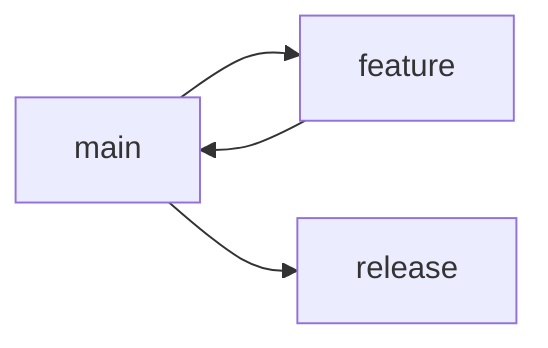

# 主干开发工作流

本节将介绍主干开发（Trunk-Based Development）工作流的使用方法，这是一种适合持续集成和持续部署的工作流程。

## 基本概念

### 1. 核心原则

1. 主要特点
- 短生命周期分支
- 频繁集成
- 持续部署
- 特性开关

2. 工作模式
```bash
# 主干开发
git checkout main
git pull
git commit -m "feat: add feature"
git push origin main
```

### 2. 分支策略

1. 分支类型
```bash
# 主干分支
main

# 发布分支
release/1.0.0

# 短期特性分支
feature/quick-fix
```

2. 分支生命周期


## 开发流程

### 1. 特性开发

1. 短期分支
```bash
# 创建特性分支
git checkout -b feature/quick-fix

# 完成开发
git commit -m "feat: implement quick fix"

# 合并回主干
git checkout main
git merge feature/quick-fix
```

2. 直接提交
```bash
# 在主干开发
git checkout main
git pull

# 提交更改
git commit -m "feat: add small feature"
git push origin main
```

### 2. 特性开关

1. 代码实现
```javascript
// 特性开关
const FEATURES = {
  newFeature: process.env.ENABLE_NEW_FEATURE === 'true'
};

if (FEATURES.newFeature) {
  // 新特性代码
} else {
  // 旧代码
}
```

2. 配置管理
```yaml
# 特性配置
features:
  newFeature: true
  betaFeature: false
```

## 持续集成

### 1. CI 配置

1. GitHub Actions
```yaml
# .github/workflows/ci.yml
name: CI

on:
  push:
    branches: [ main ]
  pull_request:
    branches: [ main ]

jobs:
  test:
    runs-on: ubuntu-latest
    steps:
      - uses: actions/checkout@v2
      - name: Run tests
        run: npm test
```

2. 自动化测试
```bash
# 运行测试
npm test

# 代码检查
npm run lint

# 构建检查
npm run build
```

### 2. 部署策略

1. 蓝绿部署
```yaml
# .github/workflows/deploy.yml
name: Deploy

on:
  push:
    branches: [ main ]

jobs:
  deploy:
    runs-on: ubuntu-latest
    steps:
      - uses: actions/checkout@v2
      - name: Deploy Blue
        if: github.ref == 'refs/heads/main'
        run: |
          deploy-blue.sh
          health-check.sh
          switch-traffic.sh
```

2. 金丝雀发布
```yaml
name: Canary Deploy

on:
  push:
    branches: [ main ]

jobs:
  canary:
    runs-on: ubuntu-latest
    steps:
      - name: Deploy Canary
        run: |
          deploy-canary.sh 10%
          monitor-metrics.sh
          rollout-full.sh
```

1. GitHub Actions
```yaml
# .github/workflows/ci.yml
name: CI

on:
  push:
    branches: [ main ]
  pull_request:
    branches: [ main ]

jobs:
  test:
    runs-on: ubuntu-latest
    steps:
      - uses: actions/checkout@v2
      - name: Run tests
        run: npm test
```

2. 自动化测试
```bash
# 运行测试
npm test

# 代码检查
npm run lint

# 构建检查
npm run build
```

### 2. 部署流程

1. 持续部署
```yaml
# 部署配置
deploy:
  stage: deploy
  script:
    - deploy.sh
  only:
    - main
```

2. 环境管理
```bash
# 开发环境
npm run deploy:dev

# 生产环境
npm run deploy:prod
```

## 版本管理

### 1. 发布策略

1. 持续发布
```bash
# 标记版本
git tag -a v1.0.0 -m "Version 1.0.0"

# 推送标签
git push origin v1.0.0
```

2. 发布分支
```bash
# 创建发布分支
git checkout -b release/1.0.0 main

# 修复问题
git commit -m "fix: pre-release fixes"

# 合并回主干
git checkout main
git merge release/1.0.0
```

### 2. 版本控制

1. 语义化版本
```bash
# 主版本
v1.0.0

# 次版本
v1.1.0

# 补丁版本
v1.1.1
```

2. 发布说明
```markdown
# Release Notes v1.0.0

## Features
- Continuous deployment
- Feature toggles

## Improvements
- Performance optimization
- Better error handling
```

## 代码评审

### 1. 评审流程

1. Pull Request
```bash
# 创建 PR
gh pr create

# 评审代码
gh pr review

# 合并 PR
gh pr merge
```

2. 评审标准
```markdown
## 评审清单
- [ ] 代码质量
- [ ] 测试覆盖
- [ ] 性能影响
- [ ] 向后兼容
```

### 2. 自动化检查

1. 代码检查
```json
{
  "scripts": {
    "lint": "eslint .",
    "test": "jest",
    "build": "webpack"
  }
}
```

2. CI 检查
```yaml
checks:
  - name: lint
    run: npm run lint
  - name: test
    run: npm test
  - name: build
    run: npm run build
```

## 特性开关

### 1. 实现方式

1. 配置文件
```javascript
// config/features.js
module.exports = {
  features: {
    newUI: process.env.ENABLE_NEW_UI === 'true',
    betaAPI: process.env.ENABLE_BETA_API === 'true'
  }
};
```

2. 运行时控制
```javascript
// 特性管理器
class FeatureManager {
  isEnabled(feature) {
    return this.features[feature] || false;
  }

  enable(feature) {
    this.features[feature] = true;
  }

  disable(feature) {
    this.features[feature] = false;
  }
}
```

### 2. 使用策略

1. 渐进式发布
```javascript
// 按用户群开启
if (featureManager.isEnabled('newUI') && user.isBetaTester) {
  showNewUI();
} else {
  showOldUI();
}
```

2. A/B 测试
```javascript
// 实验组控制
if (featureManager.isEnabled('experiment') && user.inExperimentGroup) {
  runExperiment();
} else {
  runControl();
}
```

## 最佳实践

### 1. 工作建议

1. 代码管理
- 小步提交
- 频繁集成
- 自动化测试
- 快速反馈

2. 团队协作
- 及时沟通
- 代码评审
- 共享知识
- 持续改进

### 2. 质量控制

1. 测试策略
```bash
# 单元测试
npm run test:unit

# 集成测试
npm run test:integration

# 端到端测试
npm run test:e2e
```

2. 监控反馈
```javascript
// 错误监控
if (featureManager.isEnabled('newFeature')) {
  try {
    // 新特性代码
  } catch (error) {
    monitoring.captureError(error);
    // 回退到旧代码
  }
}
```

## 常见问题

### 1. 集成冲突

1. 预防措施
```bash
# 频繁同步
git pull --rebase origin main

# 小步提交
git commit -am "feat: small change"
```

2. 解决冲突
```bash
# 解决冲突
git mergetool

# 继续变基
git rebase --continue
```

### 2. 部署问题

1. 回滚策略
```bash
# 快速回滚
git revert HEAD

# 禁用特性
featureManager.disable('problematicFeature');
```

2. 监控告警
```javascript
// 健康检查
monitoring.check('newFeature', {
  threshold: 0.1,
  callback: (error) => {
    featureManager.disable('newFeature');
    notify.alert('Feature disabled due to high error rate');
  }
});
```

## 学习要点
1. 理解主干开发
2. 掌握特性开关
3. 实践持续集成
4. 管理发布流程

## 小结
主干开发工作流适合快速迭代和持续部署的项目。通过本节的学习，你应该能够在实际项目中应用主干开发工作流。

## 练习题
1. 实施主干开发
2. 配置特性开关
3. 设置持续集成
4. 处理发布流程
